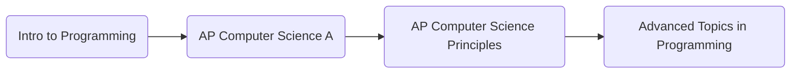

# Background
I learned nodes and lists in a course offered at my high school. These are programs I wrote answering the prompt given. 

These are the courses I took:  

-- 
## What I Learned
* how to reverse a list
* how to display a list
* how to manipulate a list with the <code>ListIterator</code> interface
* how to remove from a list
* how to insert into a list
* how to manipulate nodes
* how to insert a node
* how to remove a node
* how to manipulate linkedlists using nodes
* ...
